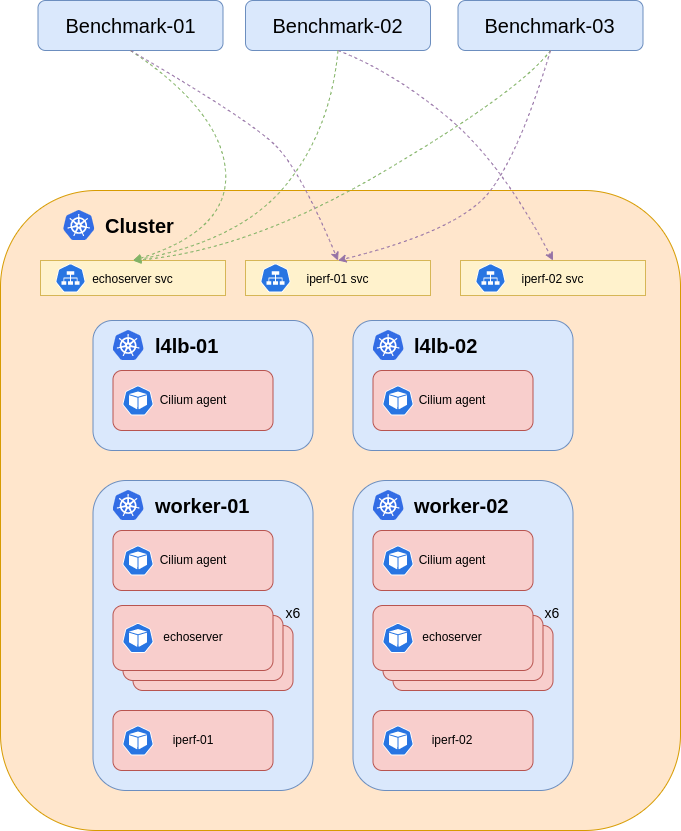

# Cilium tests

Each test (RPS and Throughtput) has been executed three times and here you can find the best results.

You can find the deployed yamls for the [Workloads](./k8s-yamls/Workloads/) ([iperf3](https://hub.docker.com/r/networkstatic/iperf3) and [echoserver](https://hub.docker.com/r/cilium/echoserver)) and the [CiliumNetworkPolicies](./k8s-yamls/CiliumNetworkPolicy/).

Test architecture:



## Test 1

value.yaml:
```
bgp:
  enabled: true
  announce:
    loadbalancerIP: true
bandwidthManager:
  enabled: true
ipam:
  mode: kubernetes
loadBalancer:
  algorithm: maglev
  serviceTopology: true
bpf:
  masquerade: true
```

### RPS

#### Benchmark-01:
```
Summary:
  Total:        600.7303 secs
  Slowest:      2.0631 secs
  Fastest:      0.0005 secs
  Average:      0.5998 secs
  Requests/sec: 60928.7572


Response time histogram:
  0.001 [1]     |
  0.207 [997905]        |■■■■■■■■■■■■■■■■■■■■■■■■■■■■■■■■■■■■■■■■
  0.413 [779]   |
  0.619 [7]     |
  0.826 [7]     |
  1.032 [547]   |
  1.238 [726]   |
  1.444 [8]     |
  1.651 [10]    |
  1.857 [0]     |
  2.063 [10]    |


Latency distribution:
  10% in 0.0179 secs
  25% in 0.0221 secs
  50% in 0.0267 secs
  75% in 0.0318 secs
  90% in 0.0376 secs
  95% in 0.0416 secs
  99% in 0.0511 secs

Details (average, fastest, slowest):
  DNS+dialup:   0.2403 secs, 0.0005 secs, 2.0631 secs
  DNS-lookup:   0.0000 secs, 0.0000 secs, 0.0000 secs
  req write:    0.0653 secs, 0.0000 secs, 0.0296 secs
  resp wait:    0.2280 secs, 0.0002 secs, 1.4894 secs
  resp read:    0.0661 secs, 0.0000 secs, 0.0273 secs

Status code distribution:
  [200] 1000000 responses
```

#### Benchmark-02:
```
Summary:
  Total:        619.9437 secs
  Slowest:      15.3689 secs
  Fastest:      0.0005 secs
  Average:      0.2013 secs
  Requests/sec: 3159.7803


Response time histogram:
  0.000 [1]     |
  1.537 [999296]        |■■■■■■■■■■■■■■■■■■■■■■■■■■■■■■■■■■■■■■■■
  3.074 [498]   |
  4.611 [4]     |
  6.148 [43]    |
  7.685 [96]    |
  9.222 [0]     |
  10.758 [0]    |
  12.295 [0]    |
  13.832 [0]    |
  15.369 [62]   |


Latency distribution:
  10% in 0.0103 secs
  25% in 0.0297 secs
  50% in 0.0418 secs
  75% in 0.0505 secs
  90% in 0.0580 secs
  95% in 0.0625 secs
  99% in 0.0734 secs

Details (average, fastest, slowest):
  DNS+dialup:   0.1611 secs, 0.0005 secs, 15.3689 secs
  DNS-lookup:   0.0000 secs, 0.0000 secs, 0.0000 secs
  req write:    0.0050 secs, 0.0000 secs, 0.0550 secs
  resp wait:    0.0300 secs, 0.0002 secs, 0.8130 secs
  resp read:    0.0052 secs, 0.0000 secs, 0.0537 secs

Status code distribution:
  [200] 1000000 responses

Error distribution:
  [18398]       Get "http://[ECHOSERVER_LB_SERVICE_IP]/": context deadline exceeded (Client.Timeout exceeded while awaiting headers)
  [1962]        Get "http://[ECHOSERVER_LB_SERVICE_IP]/": dial tcp [ECHOSERVER_LB_SERVICE_IP]:80: i/o timeout (Client.Timeout exceeded while awaiting headers)
```

### iperf3

#### Benchmark-01:
```
# iperf3 -c [IPERF_01_LB_SERVICE_IP] -t 600 -i 30
Connecting to host [IPERF_01_LB_SERVICE_IP], port 5201
[  5] local 46.4.189.34 port 34608 connected to [IPERF_01_LB_SERVICE_IP] port 5201
[ ID] Interval           Transfer     Bitrate         Retr  Cwnd
[  5]   0.00-30.00  sec  21.0 GBytes  6.01 Gbits/sec  1411   1.18 MBytes       
[  5]  30.00-60.00  sec  23.4 GBytes  6.71 Gbits/sec  1980    957 KBytes       
[  5]  60.00-90.00  sec  23.2 GBytes  6.65 Gbits/sec  1666   1.01 MBytes       
[  5]  90.00-120.00 sec  23.3 GBytes  6.67 Gbits/sec  1229   1.02 MBytes       
[  5] 120.00-150.00 sec  23.2 GBytes  6.66 Gbits/sec  1811   1.11 MBytes       
[  5] 150.00-180.00 sec  23.0 GBytes  6.59 Gbits/sec  1228    931 KBytes       
[  5] 180.00-210.00 sec  23.3 GBytes  6.67 Gbits/sec  1188   1.10 MBytes       
[  5] 210.00-240.00 sec  23.4 GBytes  6.71 Gbits/sec  1562   1.30 MBytes       
[  5] 240.00-270.00 sec  23.8 GBytes  6.82 Gbits/sec  1301   1.09 MBytes       
[  5] 270.00-300.00 sec  23.6 GBytes  6.77 Gbits/sec  1774   1.16 MBytes       
[  5] 300.00-330.00 sec  23.6 GBytes  6.75 Gbits/sec  2017   1.13 MBytes       
[  5] 330.00-360.00 sec  23.6 GBytes  6.77 Gbits/sec  1919   1.29 MBytes       
[  5] 360.00-390.00 sec  23.6 GBytes  6.77 Gbits/sec  1648   1.19 MBytes       
[  5] 390.00-420.00 sec  23.6 GBytes  6.77 Gbits/sec  1652    961 KBytes       
[  5] 420.00-450.00 sec  23.6 GBytes  6.76 Gbits/sec  1653   1024 KBytes       
[  5] 450.00-480.00 sec  23.6 GBytes  6.74 Gbits/sec  1477   1.08 MBytes       
[  5] 480.00-510.00 sec  23.5 GBytes  6.74 Gbits/sec  1546   1.04 MBytes       
[  5] 510.00-540.00 sec  23.8 GBytes  6.81 Gbits/sec  1680   1.13 MBytes       
[  5] 540.00-570.00 sec  23.7 GBytes  6.78 Gbits/sec  1531   1016 KBytes       
[  5] 570.00-600.00 sec  23.6 GBytes  6.77 Gbits/sec  1489   1.19 MBytes       
- - - - - - - - - - - - - - - - - - - - - - - - -
[ ID] Interval           Transfer     Bitrate         Retr
[  5]   0.00-600.00 sec   468 GBytes  6.70 Gbits/sec  31762             sender
[  5]   0.00-600.04 sec   468 GBytes  6.70 Gbits/sec                  receiver

iperf Done.
```

#### Benchmark-02:
```
# iperf3 -c [IPERF_02_LB_SERVICE_IP] -t 600 -i 30
Connecting to host [IPERF_02_LB_SERVICE_IP], port 5201
[  5] local 46.4.189.35 port 54188 connected to [IPERF_02_LB_SERVICE_IP] port 5201
[ ID] Interval           Transfer     Bitrate         Retr  Cwnd
[  5]   0.00-30.00  sec  20.6 GBytes  5.90 Gbits/sec  3130   1.52 MBytes       
[  5]  30.00-60.00  sec  21.0 GBytes  6.02 Gbits/sec  3252   1.16 MBytes       
[  5]  60.00-90.00  sec  20.7 GBytes  5.93 Gbits/sec  2670   1.22 MBytes       
[  5]  90.00-120.00 sec  20.5 GBytes  5.88 Gbits/sec  3018   1.18 MBytes       
[  5] 120.00-150.00 sec  22.3 GBytes  6.40 Gbits/sec  3429   1.08 MBytes       
[  5] 150.00-180.00 sec  22.3 GBytes  6.38 Gbits/sec  3115   1.10 MBytes       
[  5] 180.00-210.00 sec  21.6 GBytes  6.20 Gbits/sec  2754   1001 KBytes       
[  5] 210.00-240.00 sec  22.3 GBytes  6.39 Gbits/sec  3447   1.15 MBytes       
[  5] 240.00-270.00 sec  22.7 GBytes  6.51 Gbits/sec  3980   1.08 MBytes       
[  5] 270.00-300.00 sec  21.6 GBytes  6.19 Gbits/sec  3076   1.06 MBytes       
[  5] 300.00-330.00 sec  22.3 GBytes  6.38 Gbits/sec  2883   1.36 MBytes       
[  5] 330.00-360.00 sec  21.5 GBytes  6.16 Gbits/sec  2399   1.13 MBytes       
[  5] 360.00-390.00 sec  21.4 GBytes  6.12 Gbits/sec  2840   1.19 MBytes       
[  5] 390.00-420.00 sec  22.6 GBytes  6.48 Gbits/sec  2828   1.61 MBytes       
[  5] 420.00-450.00 sec  22.1 GBytes  6.34 Gbits/sec  2864   1.16 MBytes       
[  5] 450.00-480.00 sec  22.7 GBytes  6.49 Gbits/sec  3639    855 KBytes       
[  5] 480.00-510.00 sec  22.2 GBytes  6.36 Gbits/sec  2959   1.29 MBytes       
[  5] 510.00-540.00 sec  21.8 GBytes  6.23 Gbits/sec  3788   1005 KBytes       
[  5] 540.00-570.00 sec  21.4 GBytes  6.12 Gbits/sec  2884    983 KBytes       
[  5] 570.00-600.00 sec  21.3 GBytes  6.10 Gbits/sec  2766   1.37 MBytes       
- - - - - - - - - - - - - - - - - - - - - - - - -
[ ID] Interval           Transfer     Bitrate         Retr
[  5]   0.00-600.00 sec   435 GBytes  6.23 Gbits/sec  61721             sender
[  5]   0.00-600.04 sec   435 GBytes  6.23 Gbits/sec                  receiver

iperf Done.
```

## Test 2

value.yaml:
```
bgp:
  enabled: true
  announce:
    loadbalancerIP: true
bandwidthManager:
  enabled: true
ipam:
  mode: kubernetes
k8sServiceHost: [K8S_CONTROL_PLANE_IP]
k8sServicePort: 6443
kubeProxyReplacement: strict
loadBalancer:
  algorithm: maglev
  serviceTopology: true
bpf:
  masquerade: true
```

### RPS

#### Senchmark-01:
```
Summary:
  Total:        600.0094 secs
  Slowest:      3.5711 secs
  Fastest:      0.0005 secs
  Average:      0.5999 secs
  Requests/sec: 23099.4492


Response time histogram:
  0.000 [1]     |
  0.358 [998996]        |■■■■■■■■■■■■■■■■■■■■■■■■■■■■■■■■■■■■■■■■
  0.715 [19]    |
  1.072 [846]   |
  1.429 [134]   |
  1.786 [2]     |
  2.143 [0]     |
  2.500 [0]     |
  2.857 [0]     |
  3.214 [0]     |
  3.571 [2]     |


Latency distribution:
  10% in 0.0252 secs
  25% in 0.0332 secs
  50% in 0.0420 secs
  75% in 0.0515 secs
  90% in 0.0612 secs
  95% in 0.0678 secs
  99% in 0.0820 secs

Details (average, fastest, slowest):
  DNS+dialup:   0.2565 secs, 0.0005 secs, 3.5711 secs
  DNS-lookup:   0.0000 secs, 0.0000 secs, 0.0000 secs
  req write:    0.0488 secs, 0.0000 secs, 0.0502 secs
  resp wait:    0.2429 secs, 0.0002 secs, 2.5322 secs
  resp read:    0.0516 secs, 0.0000 secs, 0.0435 secs

Status code distribution:
  [200] 1000000 responses
```

#### Benchmark-02:
```
Summary:
  Total:        600.0279 secs
  Slowest:      3.0879 secs
  Fastest:      0.0005 secs
  Average:      0.5998 secs
  Requests/sec: 54268.4503


Response time histogram:
  0.000 [1]     |
  0.309 [998747]        |■■■■■■■■■■■■■■■■■■■■■■■■■■■■■■■■■■■■■■■■
  0.618 [119]   |
  0.927 [0]     |
  1.235 [1095]  |
  1.544 [10]    |
  1.853 [2]     |
  2.162 [9]     |
  2.470 [0]     |
  2.779 [0]     |
  3.088 [17]    |


Latency distribution:
  10% in 0.0037 secs
  25% in 0.0086 secs
  50% in 0.0133 secs
  75% in 0.0247 secs
  90% in 0.0344 secs
  95% in 0.0403 secs
  99% in 0.0522 secs

Details (average, fastest, slowest):
  DNS+dialup:   0.2458 secs, 0.0005 secs, 3.0879 secs
  DNS-lookup:   0.0000 secs, 0.0000 secs, 0.0000 secs
  req write:    0.0614 secs, 0.0000 secs, 0.0172 secs
  resp wait:    0.2304 secs, 0.0002 secs, 1.5401 secs
  resp read:    0.0621 secs, 0.0000 secs, 0.0146 secs

Status code distribution:
  [200] 1000000 responses
```

### iperf3

#### Benchmark-01:
```
Connecting to host [IPERF_01_LB_SERVICE_IP], port 5201
[  5] local 46.4.189.34 port 42000 connected to [IPERF_01_LB_SERVICE_IP] port 5201
[ ID] Interval           Transfer     Bitrate         Retr  Cwnd
[  5]   0.00-30.00  sec  22.0 GBytes  6.29 Gbits/sec  1049   1.31 MBytes       
[  5]  30.00-60.00  sec  24.1 GBytes  6.90 Gbits/sec  1041   1.21 MBytes       
[  5]  60.00-90.00  sec  24.4 GBytes  6.99 Gbits/sec  1190   1.20 MBytes       
[  5]  90.00-120.00 sec  24.8 GBytes  7.11 Gbits/sec  1455   1.07 MBytes       
[  5] 120.00-150.00 sec  24.7 GBytes  7.08 Gbits/sec  957   1.06 MBytes       
[  5] 150.00-180.00 sec  24.3 GBytes  6.94 Gbits/sec  1318   1.21 MBytes       
[  5] 180.00-210.00 sec  24.4 GBytes  6.99 Gbits/sec  848   1.01 MBytes       
[  5] 210.00-240.00 sec  24.7 GBytes  7.07 Gbits/sec  932    927 KBytes       
[  5] 240.00-270.00 sec  24.6 GBytes  7.06 Gbits/sec  1101   1.01 MBytes       
[  5] 270.00-300.00 sec  24.2 GBytes  6.92 Gbits/sec  1789   1.21 MBytes       
[  5] 300.00-330.00 sec  24.6 GBytes  7.05 Gbits/sec  1125   1.29 MBytes       
[  5] 330.00-360.00 sec  24.7 GBytes  7.07 Gbits/sec  1186   1.03 MBytes       
[  5] 360.00-390.00 sec  24.4 GBytes  6.99 Gbits/sec  1144   1.17 MBytes       
[  5] 390.00-420.00 sec  24.6 GBytes  7.04 Gbits/sec  1212    962 KBytes       
[  5] 420.00-450.00 sec  24.4 GBytes  7.00 Gbits/sec  1252   1.19 MBytes       
[  5] 450.00-480.00 sec  24.7 GBytes  7.07 Gbits/sec  1120   1.01 MBytes       
[  5] 480.00-510.00 sec  24.6 GBytes  7.04 Gbits/sec  1300   1017 KBytes       
[  5] 510.00-540.00 sec  24.5 GBytes  7.02 Gbits/sec  1333   1.13 MBytes       
[  5] 540.00-570.00 sec  24.4 GBytes  6.99 Gbits/sec  1382   1.26 MBytes       
[  5] 570.00-600.00 sec  24.6 GBytes  7.05 Gbits/sec  1691   1.19 MBytes       
- - - - - - - - - - - - - - - - - - - - - - - - -
[ ID] Interval           Transfer     Bitrate         Retr
[  5]   0.00-600.00 sec   488 GBytes  6.98 Gbits/sec  24425             sender
[  5]   0.00-600.04 sec   488 GBytes  6.98 Gbits/sec                  receiver

iperf Done.
```

#### Benchmark-02:
```
Connecting to host [IPERF_02_LB_SERVICE_IP], port 5201
[  5] local 46.4.189.35 port 48334 connected to [IPERF_02_LB_SERVICE_IP] port 5201
[ ID] Interval           Transfer     Bitrate         Retr  Cwnd
[  5]   0.00-30.00  sec  23.3 GBytes  6.66 Gbits/sec  1600   1.25 MBytes       
[  5]  30.00-60.00  sec  23.2 GBytes  6.63 Gbits/sec  1111   1.07 MBytes       
[  5]  60.00-90.00  sec  21.6 GBytes  6.20 Gbits/sec  1021   1.11 MBytes       
[  5]  90.00-120.00 sec  22.3 GBytes  6.39 Gbits/sec  959   1.32 MBytes       
[  5] 120.00-150.00 sec  21.3 GBytes  6.10 Gbits/sec  1857   1016 KBytes       
[  5] 150.00-180.00 sec  19.9 GBytes  5.69 Gbits/sec  1366   1.20 MBytes       
[  5] 180.00-210.00 sec  22.1 GBytes  6.31 Gbits/sec  1425   1.37 MBytes       
[  5] 210.00-240.00 sec  22.5 GBytes  6.45 Gbits/sec  1474   1.35 MBytes       
[  5] 240.00-270.00 sec  21.1 GBytes  6.04 Gbits/sec  1508   1.48 MBytes       
[  5] 270.00-300.00 sec  19.9 GBytes  5.71 Gbits/sec  2027   1.53 MBytes       
[  5] 300.00-330.00 sec  21.3 GBytes  6.10 Gbits/sec  1084   1.18 MBytes       
[  5] 330.00-360.00 sec  20.9 GBytes  5.99 Gbits/sec  1777   1.19 MBytes       
[  5] 360.00-390.00 sec  24.6 GBytes  7.04 Gbits/sec  1502   1.57 MBytes       
[  5] 390.00-420.00 sec  22.3 GBytes  6.38 Gbits/sec  2337   1.57 MBytes       
[  5] 420.00-450.00 sec  20.0 GBytes  5.71 Gbits/sec  2449   1.35 MBytes       
[  5] 450.00-480.00 sec  21.4 GBytes  6.13 Gbits/sec  1524   1.51 MBytes       
[  5] 480.00-510.00 sec  20.1 GBytes  5.76 Gbits/sec  1247   1.30 MBytes       
[  5] 510.00-540.00 sec  23.3 GBytes  6.68 Gbits/sec  1623   1.33 MBytes       
[  5] 540.00-570.00 sec  20.9 GBytes  6.00 Gbits/sec  1385   1.23 MBytes       
[  5] 570.00-600.00 sec  20.8 GBytes  5.95 Gbits/sec  1887   1.35 MBytes       
- - - - - - - - - - - - - - - - - - - - - - - - -
[ ID] Interval           Transfer     Bitrate         Retr
[  5]   0.00-600.00 sec   433 GBytes  6.20 Gbits/sec  31163             sender
[  5]   0.00-600.04 sec   433 GBytes  6.20 Gbits/sec                  receiver

iperf Done.
```

## Test 3

value.yaml:
```
bgp:
  enabled: true
  announce:
    loadbalancerIP: true
bandwidthManager:
  enabled: true
ipam:
  mode: kubernetes
k8sServiceHost: [K8S_CONTROL_PLANE_IP]
k8sServicePort: 6443
kubeProxyReplacement: strict
loadBalancer:
  algorithm: maglev
  serviceTopology: true
tunnel: disabled
ipv4NativeRoutingCIDR: "10.9.0.0/17"
autoDirectNodeRoutes: true
bpf:
  masquerade: true
```

### RPS

#### Benchmark-01:
```
Summary:
  Total:        600.0067 secs
  Slowest:      0.0715 secs
  Fastest:      0.0039 secs
  Average:      0.5998 secs
  Requests/sec: 38207.7908


Response time histogram:
  0.004 [1]     |
  0.011 [6546]  |■
  0.017 [40498] |■■■■
  0.024 [355930]        |■■■■■■■■■■■■■■■■■■■■■■■■■■■■■■■■■■■■
  0.031 [400725]        |■■■■■■■■■■■■■■■■■■■■■■■■■■■■■■■■■■■■■■■■
  0.038 [153925]        |■■■■■■■■■■■■■■■
  0.044 [36093] |■■■■
  0.051 [5125]  |■
  0.058 [832]   |
  0.065 [271]   |
  0.072 [54]    |


Latency distribution:
  10% in 0.0193 secs
  25% in 0.0219 secs
  50% in 0.0256 secs
  75% in 0.0298 secs
  90% in 0.0340 secs
  95% in 0.0370 secs
  99% in 0.0428 secs

Details (average, fastest, slowest):
  DNS+dialup:   0.2389 secs, 0.0039 secs, 0.0715 secs
  DNS-lookup:   0.0000 secs, 0.0000 secs, 0.0000 secs
  req write:    0.0507 secs, 0.0000 secs, 0.0242 secs
  resp wait:    0.2583 secs, 0.0002 secs, 0.0430 secs
  resp read:    0.0519 secs, 0.0000 secs, 0.0197 secs

Status code distribution:
  [200] 1000000 responses
```

#### Benchmark-02:
```
Summary:
  Total:        600.0106 secs
  Slowest:      0.0862 secs
  Fastest:      0.0039 secs
  Average:      0.5998 secs
  Requests/sec: 47464.5779


Response time histogram:
  0.004 [1]     |
  0.012 [50497] |■■■■
  0.020 [532654]        |■■■■■■■■■■■■■■■■■■■■■■■■■■■■■■■■■■■■■■■■
  0.029 [380138]        |■■■■■■■■■■■■■■■■■■■■■■■■■■■■■
  0.037 [32132] |■■
  0.045 [3109]  |
  0.053 [794]   |
  0.062 [178]   |
  0.070 [336]   |
  0.078 [160]   |
  0.086 [1]     |


Latency distribution:
  10% in 0.0136 secs
  25% in 0.0164 secs
  50% in 0.0195 secs
  75% in 0.0224 secs
  90% in 0.0255 secs
  95% in 0.0277 secs
  99% in 0.0328 secs

Details (average, fastest, slowest):
  DNS+dialup:   0.2285 secs, 0.0039 secs, 0.0862 secs
  DNS-lookup:   0.0000 secs, 0.0000 secs, 0.0000 secs
  req write:    0.0610 secs, 0.0000 secs, 0.0214 secs
  resp wait:    0.2471 secs, 0.0002 secs, 0.0437 secs
  resp read:    0.0630 secs, 0.0000 secs, 0.0204 secs

Status code distribution:
  [200] 1000000 responses
```

### iperf3

#### Benchmark-01:
```
Connecting to host [IPERF_01_LB_SERVICE_IP], port 5201
[  5] local 46.4.189.34 port 42198 connected to [IPERF_01_LB_SERVICE_IP] port 5201
[ ID] Interval           Transfer     Bitrate         Retr  Cwnd
[  5]   0.00-30.00  sec  32.2 GBytes  9.22 Gbits/sec  4415   2.14 MBytes       
[  5]  30.00-60.00  sec  32.7 GBytes  9.37 Gbits/sec  2805   2.27 MBytes       
[  5]  60.00-90.00  sec  32.7 GBytes  9.36 Gbits/sec  1738   2.72 MBytes       
[  5]  90.00-120.00 sec  32.7 GBytes  9.37 Gbits/sec  4010   1.80 MBytes       
[  5] 120.00-150.00 sec  32.2 GBytes  9.23 Gbits/sec  4477   2.92 MBytes       
[  5] 150.00-180.00 sec  32.8 GBytes  9.38 Gbits/sec  4249   2.12 MBytes       
[  5] 180.00-210.00 sec  32.4 GBytes  9.29 Gbits/sec  2419   2.29 MBytes       
[  5] 210.00-240.00 sec  32.3 GBytes  9.25 Gbits/sec  5112   1.84 MBytes       
[  5] 240.00-270.00 sec  32.4 GBytes  9.28 Gbits/sec  3166   1.95 MBytes       
[  5] 270.00-300.00 sec  32.2 GBytes  9.22 Gbits/sec  1644   2.39 MBytes       
[  5] 300.00-330.00 sec  32.7 GBytes  9.38 Gbits/sec  731   2.94 MBytes       
[  5] 330.00-360.00 sec  32.8 GBytes  9.38 Gbits/sec  1980   1.48 MBytes       
[  5] 360.00-390.00 sec  32.8 GBytes  9.38 Gbits/sec  3033   2.91 MBytes       
[  5] 390.00-420.00 sec  32.8 GBytes  9.38 Gbits/sec  2162   3.00 MBytes       
[  5] 420.00-450.00 sec  32.8 GBytes  9.39 Gbits/sec  1511   2.96 MBytes       
[  5] 450.00-480.00 sec  32.7 GBytes  9.36 Gbits/sec  4280   1.97 MBytes       
[  5] 480.00-510.00 sec  32.8 GBytes  9.39 Gbits/sec  1345   2.30 MBytes       
[  5] 510.00-540.00 sec  32.8 GBytes  9.38 Gbits/sec  1530   2.87 MBytes       
[  5] 540.00-570.00 sec  32.7 GBytes  9.37 Gbits/sec  1558   3.01 MBytes       
[  5] 570.00-600.00 sec  32.6 GBytes  9.33 Gbits/sec  2444   1.43 MBytes       
- - - - - - - - - - - - - - - - - - - - - - - - -
[ ID] Interval           Transfer     Bitrate         Retr
[  5]   0.00-600.00 sec   652 GBytes  9.33 Gbits/sec  54609             sender
[  5]   0.00-600.04 sec   652 GBytes  9.33 Gbits/sec                  receiver

iperf Done.
```

#### Benchmark-02:
```
Connecting to host [IPERF_02_LB_SERVICE_IP], port 5201
[  5] local 46.4.189.35 port 9356 connected to [IPERF_02_LB_SERVICE_IP] port 5201
[ ID] Interval           Transfer     Bitrate         Retr  Cwnd
[  5]   0.00-30.00  sec  26.5 GBytes  7.58 Gbits/sec  134248    450 KBytes       
[  5]  30.00-60.00  sec  26.5 GBytes  7.59 Gbits/sec  135062    199 KBytes       
[  5]  60.00-90.00  sec  26.3 GBytes  7.54 Gbits/sec  128940    809 KBytes       
[  5]  90.00-120.00 sec  26.5 GBytes  7.59 Gbits/sec  127963    423 KBytes       
[  5] 120.00-150.00 sec  26.5 GBytes  7.58 Gbits/sec  137121    516 KBytes       
[  5] 150.00-180.00 sec  26.4 GBytes  7.57 Gbits/sec  130122    436 KBytes       
[  5] 180.00-210.00 sec  26.3 GBytes  7.53 Gbits/sec  129950    913 KBytes       
[  5] 210.00-240.00 sec  26.5 GBytes  7.60 Gbits/sec  136690    672 KBytes       
[  5] 240.00-270.00 sec  26.4 GBytes  7.56 Gbits/sec  128979    643 KBytes       
[  5] 270.00-300.00 sec  26.5 GBytes  7.58 Gbits/sec  129861    677 KBytes       
[  5] 300.00-330.00 sec  26.4 GBytes  7.57 Gbits/sec  131129    667 KBytes       
[  5] 330.00-360.00 sec  26.3 GBytes  7.54 Gbits/sec  139599    573 KBytes       
[  5] 360.00-390.00 sec  26.1 GBytes  7.47 Gbits/sec  135191    526 KBytes       
[  5] 390.00-420.00 sec  26.5 GBytes  7.57 Gbits/sec  131447    506 KBytes       
[  5] 420.00-450.00 sec  26.5 GBytes  7.57 Gbits/sec  132263    926 KBytes       
[  5] 450.00-480.00 sec  26.3 GBytes  7.53 Gbits/sec  128107    628 KBytes       
[  5] 480.00-510.00 sec  26.5 GBytes  7.58 Gbits/sec  151737    868 KBytes       
[  5] 510.00-540.00 sec  26.4 GBytes  7.57 Gbits/sec  132101    646 KBytes       
[  5] 540.00-570.00 sec  26.3 GBytes  7.52 Gbits/sec  137192    609 KBytes       
[  5] 570.00-600.00 sec  26.6 GBytes  7.61 Gbits/sec  151658    686 KBytes       
- - - - - - - - - - - - - - - - - - - - - - - - -
[ ID] Interval           Transfer     Bitrate         Retr
[  5]   0.00-600.00 sec   528 GBytes  7.56 Gbits/sec  2689360             sender
[  5]   0.00-600.04 sec   528 GBytes  7.56 Gbits/sec                  receiver

iperf Done.
```
## Test 4A

value.yaml
```
bgp:
  enabled: true
  announce:
    loadbalancerIP: true
bandwidthManager:
  enabled: true
hostFirewall:
  enabled: true
ipam:
  mode: kubernetes
k8sServiceHost: [K8S_CONTROL_PLANE_IP]
k8sServicePort: 6443
kubeProxyReplacement: strict
loadBalancer:
  algorithm: maglev
  serviceTopology: true
  mode: hybrid
tunnel: disabled
ipv4NativeRoutingCIDR: "10.9.0.0/17"
autoDirectNodeRoutes: true
bpf:
  masquerade: true
```

### RPS

#### Benchmark-01:
```
Summary:
  Total:        600.0102 secs
  Slowest:      1.0528 secs
  Fastest:      0.0017 secs
  Average:      0.5998 secs
  Requests/sec: 64057.8888


Response time histogram:
  0.002 [1]     |
  0.107 [999955]        |■■■■■■■■■■■■■■■■■■■■■■■■■■■■■■■■■■■■■■■■
  0.212 [0]     |
  0.317 [0]     |
  0.422 [0]     |
  0.527 [0]     |
  0.632 [0]     |
  0.737 [0]     |
  0.843 [0]     |
  0.948 [0]     |
  1.053 [44]    |


Latency distribution:
  10% in 0.0119 secs
  25% in 0.0134 secs
  50% in 0.0153 secs
  75% in 0.0176 secs
  90% in 0.0205 secs
  95% in 0.0223 secs
  99% in 0.0266 secs

Details (average, fastest, slowest):
  DNS+dialup:   0.2163 secs, 0.0017 secs, 1.0528 secs
  DNS-lookup:   0.0000 secs, 0.0000 secs, 0.0000 secs
  req write:    0.0674 secs, 0.0000 secs, 0.0276 secs
  resp wait:    0.2470 secs, 0.0002 secs, 0.0499 secs
  resp read:    0.0690 secs, 0.0000 secs, 0.0264 secs

Status code distribution:
  [200] 1000000 responses
```

#### Benchmark-02:
```
Summary:
  Total:        600.0062 secs
  Slowest:      1.0403 secs
  Fastest:      0.0042 secs
  Average:      0.5998 secs
  Requests/sec: 67631.4729


Response time histogram:
  0.004 [1]     |
  0.108 [999958]        |■■■■■■■■■■■■■■■■■■■■■■■■■■■■■■■■■■■■■■■■
  0.211 [0]     |
  0.315 [0]     |
  0.419 [0]     |
  0.522 [0]     |
  0.626 [0]     |
  0.729 [0]     |
  0.833 [0]     |
  0.937 [0]     |
  1.040 [41]    |


Latency distribution:
  10% in 0.0110 secs
  25% in 0.0125 secs
  50% in 0.0141 secs
  75% in 0.0164 secs
  90% in 0.0194 secs
  95% in 0.0211 secs
  99% in 0.0262 secs

Details (average, fastest, slowest):
  DNS+dialup:   0.2142 secs, 0.0042 secs, 1.0403 secs
  DNS-lookup:   0.0000 secs, 0.0000 secs, 0.0000 secs
  req write:    0.0674 secs, 0.0000 secs, 0.0173 secs
  resp wait:    0.2491 secs, 0.0002 secs, 0.0491 secs
  resp read:    0.0690 secs, 0.0000 secs, 0.0143 secs

Status code distribution:
  [200] 1000000 responses
```

### iperf3

#### Benchmark-01:
```
Connecting to host [IPERF_01_LB_SERVICE_IP], port 5201
[  5] local 46.4.189.34 port 35562 connected to [IPERF_01_LB_SERVICE_IP] port 5201
[ ID] Interval           Transfer     Bitrate         Retr  Cwnd
[  5]   0.00-30.00  sec  32.8 GBytes  9.40 Gbits/sec  2707   1.99 MBytes       
[  5]  30.00-60.00  sec  32.9 GBytes  9.41 Gbits/sec  988   2.05 MBytes       
[  5]  60.00-90.00  sec  32.8 GBytes  9.40 Gbits/sec  3344   1.93 MBytes       
[  5]  90.00-120.00 sec  32.9 GBytes  9.41 Gbits/sec  1477   2.17 MBytes       
[  5] 120.00-150.00 sec  32.9 GBytes  9.41 Gbits/sec  1270   2.43 MBytes       
[  5] 150.00-180.00 sec  32.8 GBytes  9.40 Gbits/sec  3467   2.15 MBytes       
[  5] 180.00-210.00 sec  32.9 GBytes  9.41 Gbits/sec  3982   1.80 MBytes       
[  5] 210.00-240.00 sec  32.9 GBytes  9.41 Gbits/sec  1706   2.88 MBytes       
[  5] 240.00-270.00 sec  32.9 GBytes  9.41 Gbits/sec  1406   2.36 MBytes       
[  5] 270.00-300.00 sec  32.9 GBytes  9.41 Gbits/sec  2516   1.99 MBytes       
[  5] 300.00-330.00 sec  32.9 GBytes  9.41 Gbits/sec  1178   1.77 MBytes       
[  5] 330.00-360.00 sec  32.9 GBytes  9.41 Gbits/sec  3064   1.75 MBytes       
[  5] 360.00-390.00 sec  32.9 GBytes  9.41 Gbits/sec  789   2.82 MBytes       
[  5] 390.00-420.00 sec  32.9 GBytes  9.41 Gbits/sec  2660   2.06 MBytes       
[  5] 420.00-450.00 sec  32.9 GBytes  9.41 Gbits/sec  1608   2.03 MBytes       
[  5] 450.00-480.00 sec  32.8 GBytes  9.41 Gbits/sec  3173   1.68 MBytes       
[  5] 480.00-510.00 sec  32.9 GBytes  9.41 Gbits/sec  2213   1.78 MBytes       
[  5] 510.00-540.00 sec  32.9 GBytes  9.41 Gbits/sec   13   2.99 MBytes       
[  5] 540.00-570.00 sec  32.9 GBytes  9.41 Gbits/sec  3377   1.88 MBytes       
[  5] 570.00-600.00 sec  32.9 GBytes  9.41 Gbits/sec  3141   1.90 MBytes       
- - - - - - - - - - - - - - - - - - - - - - - - -
[ ID] Interval           Transfer     Bitrate         Retr
[  5]   0.00-600.00 sec   657 GBytes  9.41 Gbits/sec  44079             sender
[  5]   0.00-600.04 sec   657 GBytes  9.41 Gbits/sec                  receiver

iperf Done.
```

#### Benchmark-02:
```
Connecting to host [IPERF_02_LB_SERVICE_IP], port 5201
[  5] local 46.4.189.35 port 43472 connected to [IPERF_02_LB_SERVICE_IP] port 5201
[ ID] Interval           Transfer     Bitrate         Retr  Cwnd
[  5]   0.00-30.00  sec  32.8 GBytes  9.41 Gbits/sec  3315   1.04 MBytes       
[  5]  30.00-60.00  sec  32.8 GBytes  9.41 Gbits/sec  1839   1.68 MBytes       
[  5]  60.00-90.00  sec  32.8 GBytes  9.40 Gbits/sec  2714   1.80 MBytes       
[  5]  90.00-120.00 sec  32.8 GBytes  9.40 Gbits/sec  3168   2.20 MBytes       
[  5] 120.00-150.00 sec  32.8 GBytes  9.40 Gbits/sec  3095   1.69 MBytes       
[  5] 150.00-180.00 sec  32.8 GBytes  9.40 Gbits/sec  1958   1.17 MBytes       
[  5] 180.00-210.00 sec  32.8 GBytes  9.41 Gbits/sec  2805   2.33 MBytes       
[  5] 210.00-240.00 sec  32.8 GBytes  9.40 Gbits/sec  2307   2.08 MBytes       
[  5] 240.00-270.00 sec  32.8 GBytes  9.40 Gbits/sec  2596   1.93 MBytes       
[  5] 270.00-300.00 sec  32.9 GBytes  9.41 Gbits/sec  1205   2.10 MBytes       
[  5] 300.00-330.00 sec  32.9 GBytes  9.41 Gbits/sec  3100   1.68 MBytes       
[  5] 330.00-360.00 sec  32.9 GBytes  9.41 Gbits/sec  2006   2.02 MBytes       
[  5] 360.00-390.00 sec  32.9 GBytes  9.41 Gbits/sec  1048   1.93 MBytes       
[  5] 390.00-420.00 sec  32.9 GBytes  9.41 Gbits/sec  1702   1.53 MBytes       
[  5] 420.00-450.00 sec  32.8 GBytes  9.41 Gbits/sec  4670   2.15 MBytes       
[  5] 450.00-480.00 sec  32.8 GBytes  9.41 Gbits/sec  3172   1.03 MBytes       
[  5] 480.00-510.00 sec  32.8 GBytes  9.40 Gbits/sec  2812   1.95 MBytes       
[  5] 510.00-540.00 sec  32.9 GBytes  9.41 Gbits/sec  1754   2.12 MBytes       
[  5] 540.00-570.00 sec  32.8 GBytes  9.40 Gbits/sec  3625   1.68 MBytes       
[  5] 570.00-600.00 sec  32.8 GBytes  9.40 Gbits/sec  3817   2.51 MBytes       
- - - - - - - - - - - - - - - - - - - - - - - - -
[ ID] Interval           Transfer     Bitrate         Retr
[  5]   0.00-600.00 sec   657 GBytes  9.40 Gbits/sec  52708             sender
[  5]   0.00-600.04 sec   657 GBytes  9.40 Gbits/sec                  receiver

iperf Done.
```

## Test 4B

With [CiliumNetworkPolicy](./k8s-yamls/networkPolicies/) deployed and a 3rd benchmark (firewalled) system generating traffic.

value.yaml
```
bgp:
  enabled: true
  announce:
    loadbalancerIP: true
bandwidthManager:
  enabled: true
hostFirewall:
  enabled: true
ipam:
  mode: kubernetes
k8sServiceHost: [K8S_CONTROL_PLANE_IP]
k8sServicePort: 6443
kubeProxyReplacement: strict
loadBalancer:
  algorithm: maglev
  serviceTopology: true
  mode: hybrid
tunnel: disabled
ipv4NativeRoutingCIDR: "10.9.0.0/17"
autoDirectNodeRoutes: true
bpf:
  masquerade: true
```

### RPS

#### Benchmark-01:
```
Summary:
  Total:        600.5526 secs
  Slowest:      1.0480 secs
  Fastest:      0.0039 secs
  Average:      0.5998 secs
  Requests/sec: 64222.0282


Response time histogram:
  0.004 [1]     |
  0.108 [999994]        |■■■■■■■■■■■■■■■■■■■■■■■■■■■■■■■■■■■■■■■■
  0.213 [0]     |
  0.317 [0]     |
  0.422 [0]     |
  0.526 [0]     |
  0.630 [0]     |
  0.735 [0]     |
  0.839 [0]     |
  0.944 [0]     |
  1.048 [5]     |


Latency distribution:
  10% in 0.0120 secs
  25% in 0.0136 secs
  50% in 0.0155 secs
  75% in 0.0180 secs
  90% in 0.0209 secs
  95% in 0.0229 secs
  99% in 0.0279 secs

Details (average, fastest, slowest):
  DNS+dialup:   0.2074 secs, 0.0039 secs, 1.0480 secs
  DNS-lookup:   0.0000 secs, 0.0000 secs, 0.0000 secs
  req write:    0.0672 secs, 0.0000 secs, 0.0260 secs
  resp wait:    0.2561 secs, 0.0002 secs, 0.0468 secs
  resp read:    0.0689 secs, 0.0000 secs, 0.0172 secs

Status code distribution:
  [200] 1000000 responses
```

#### Benchmark-02:
```
Summary:
  Total:        600.2662 secs
  Slowest:      1.0260 secs
  Fastest:      0.0018 secs
  Average:      0.5998 secs
  Requests/sec: 67072.4644


Response time histogram:
  0.002 [1]     |
  0.104 [999996]        |■■■■■■■■■■■■■■■■■■■■■■■■■■■■■■■■■■■■■■■■
  0.207 [0]     |
  0.309 [0]     |
  0.412 [0]     |
  0.514 [0]     |
  0.616 [0]     |
  0.719 [0]     |
  0.821 [0]     |
  0.924 [0]     |
  1.026 [3]     |


Latency distribution:
  10% in 0.0106 secs
  25% in 0.0122 secs
  50% in 0.0139 secs
  75% in 0.0162 secs
  90% in 0.0193 secs
  95% in 0.0211 secs
  99% in 0.0275 secs

Details (average, fastest, slowest):
  DNS+dialup:   0.2050 secs, 0.0018 secs, 1.0260 secs
  DNS-lookup:   0.0000 secs, 0.0000 secs, 0.0000 secs
  req write:    0.0672 secs, 0.0000 secs, 0.0235 secs
  resp wait:    0.2585 secs, 0.0002 secs, 0.0471 secs
  resp read:    0.0689 secs, 0.0000 secs, 0.0225 secs

Status code distribution:
  [200] 1000000 responses
```

#### Benchmark-03 (firewalled):
```
Summary:
  Total:        600.0602 secs
  Slowest:      0.0000 secs
  Fastest:      0.0000 secs
  Average:       NaN secs
  Requests/sec: 49.9950


Response time histogram:


Latency distribution:

Details (average, fastest, slowest):
  DNS+dialup:    NaN secs, 0.0000 secs, 0.0000 secs
  DNS-lookup:    NaN secs, 0.0000 secs, 0.0000 secs
  req write:     NaN secs, 0.0000 secs, 0.0000 secs
  resp wait:     NaN secs, 0.0000 secs, 0.0000 secs
  resp read:     NaN secs, 0.0000 secs, 0.0000 secs

Status code distribution:

Error distribution:
  [24620]       Get "http://[ECHOSERVER_LB_SERVICE_IP]/": context deadline exceeded (Client.Timeout exceeded while awaiting headers)
  [5380]        Get "http://[ECHOSERVER_LB_SERVICE_IP]/": dial tcp [ECHOSERVER_LB_SERVICE_IP]:80: i/o timeout (Client.Timeout exceeded while awaiting headers)
```

### iperf3

#### benchmark-01:
```
Connecting to host [IPERF_01_LB_SERVICE_IP], port 5201
[  5] local 46.4.189.34 port 33796 connected to [IPERF_01_LB_SERVICE_IP] port 5201
[ ID] Interval           Transfer     Bitrate         Retr  Cwnd
[  5]   0.00-30.00  sec  32.8 GBytes  9.40 Gbits/sec  3205   1.22 MBytes       
[  5]  30.00-60.00  sec  32.9 GBytes  9.41 Gbits/sec  3007   1.55 MBytes       
[  5]  60.00-90.00  sec  32.8 GBytes  9.40 Gbits/sec  3730   1.53 MBytes       
[  5]  90.00-120.00 sec  32.9 GBytes  9.41 Gbits/sec  3980   1.22 MBytes       
[  5] 120.00-150.00 sec  32.8 GBytes  9.40 Gbits/sec  2779   1.70 MBytes       
[  5] 150.00-180.00 sec  32.8 GBytes  9.40 Gbits/sec  4756   1.85 MBytes       
[  5] 180.00-210.00 sec  32.8 GBytes  9.40 Gbits/sec  3958   1.14 MBytes       
[  5] 210.00-240.00 sec  32.8 GBytes  9.40 Gbits/sec  3345   2.34 MBytes       
[  5] 240.00-270.00 sec  32.8 GBytes  9.40 Gbits/sec  5556   1.13 MBytes       
[  5] 270.00-300.00 sec  32.8 GBytes  9.40 Gbits/sec  4667   1.20 MBytes       
[  5] 300.00-330.00 sec  32.9 GBytes  9.41 Gbits/sec  3789   1.48 MBytes       
[  5] 330.00-360.00 sec  32.8 GBytes  9.40 Gbits/sec  3389   1.63 MBytes       
[  5] 360.00-390.00 sec  32.9 GBytes  9.41 Gbits/sec  1691   1.84 MBytes       
[  5] 390.00-420.00 sec  32.8 GBytes  9.40 Gbits/sec  2795   1.56 MBytes       
[  5] 420.00-450.00 sec  32.8 GBytes  9.40 Gbits/sec  1306   2.37 MBytes       
[  5] 450.00-480.00 sec  32.9 GBytes  9.41 Gbits/sec  2159   1.64 MBytes       
[  5] 480.00-510.00 sec  32.9 GBytes  9.41 Gbits/sec  2096   1.25 MBytes       
[  5] 510.00-540.00 sec  32.9 GBytes  9.41 Gbits/sec  2424   1.30 MBytes       
[  5] 540.00-570.00 sec  32.8 GBytes  9.41 Gbits/sec  2125   1.47 MBytes       
[  5] 570.00-600.00 sec  32.9 GBytes  9.41 Gbits/sec  203   2.19 MBytes       
- - - - - - - - - - - - - - - - - - - - - - - - -
[ ID] Interval           Transfer     Bitrate         Retr
[  5]   0.00-600.00 sec   657 GBytes  9.40 Gbits/sec  60960             sender
[  5]   0.00-600.04 sec   657 GBytes  9.40 Gbits/sec                  receiver

iperf Done.
```

#### Benchmark-02:
```
Connecting to host [IPERF_02_LB_SERVICE_IP], port 5201
[  5] local 46.4.189.35 port 37030 connected to [IPERF_02_LB_SERVICE_IP] port 5201
[ ID] Interval           Transfer     Bitrate         Retr  Cwnd
[  5]   0.00-30.00  sec  32.8 GBytes  9.40 Gbits/sec  3307   2.01 MBytes       
[  5]  30.00-60.00  sec  32.8 GBytes  9.40 Gbits/sec  1694   3.01 MBytes       
[  5]  60.00-90.00  sec  32.9 GBytes  9.41 Gbits/sec  1970   3.01 MBytes       
[  5]  90.00-120.00 sec  32.9 GBytes  9.41 Gbits/sec  672   1.69 MBytes       
[  5] 120.00-150.00 sec  32.9 GBytes  9.41 Gbits/sec  4226   1.88 MBytes       
[  5] 150.00-180.00 sec  32.9 GBytes  9.41 Gbits/sec  2296   2.33 MBytes       
[  5] 180.00-210.00 sec  32.9 GBytes  9.41 Gbits/sec  1395   3.01 MBytes       
[  5] 210.00-240.00 sec  32.8 GBytes  9.40 Gbits/sec  3333   2.00 MBytes       
[  5] 240.00-270.00 sec  32.9 GBytes  9.41 Gbits/sec  1796   2.11 MBytes       
[  5] 270.00-300.00 sec  32.9 GBytes  9.41 Gbits/sec  2763   1.59 MBytes       
[  5] 300.00-330.00 sec  32.8 GBytes  9.40 Gbits/sec  2576   2.30 MBytes       
[  5] 330.00-360.00 sec  32.9 GBytes  9.41 Gbits/sec  2188   2.25 MBytes       
[  5] 360.00-390.00 sec  32.9 GBytes  9.41 Gbits/sec  2244   1.38 MBytes       
[  5] 390.00-420.00 sec  32.9 GBytes  9.41 Gbits/sec  3038   1.81 MBytes       
[  5] 420.00-450.00 sec  32.9 GBytes  9.41 Gbits/sec  2856   2.82 MBytes       
[  5] 450.00-480.00 sec  32.8 GBytes  9.40 Gbits/sec  2065   3.01 MBytes       
[  5] 480.00-510.00 sec  32.8 GBytes  9.38 Gbits/sec  488   3.01 MBytes       
[  5] 510.00-540.00 sec  32.8 GBytes  9.39 Gbits/sec  792   2.71 MBytes       
[  5] 540.00-570.00 sec  32.8 GBytes  9.40 Gbits/sec  1357   2.30 MBytes       
[  5] 570.00-600.00 sec  32.8 GBytes  9.40 Gbits/sec  3440   1.74 MBytes       
- - - - - - - - - - - - - - - - - - - - - - - - -
[ ID] Interval           Transfer     Bitrate         Retr
[  5]   0.00-600.00 sec   657 GBytes  9.40 Gbits/sec  44496             sender
[  5]   0.00-600.04 sec   657 GBytes  9.40 Gbits/sec                  receiver

iperf Done.
```

#### Benchmark-03 (firewalled):
```
iperf3: error - unable to send control message: Bad file descriptor
```
